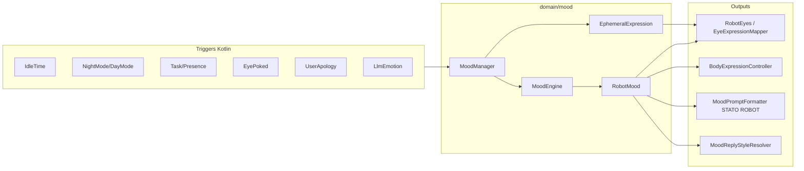

# Robot mood (wellbeing + expression)

SSOT for persistent **wellbeing valence**, **ephemeral LLM expression**, eyes, body choreography, and prompt injection (`STATO ROBOT`).

Human-first overview (IT): [`guides/UMORE.md`](guides/UMORE.md) · smoke: [`guides/UMORE_SMOKE.md`](guides/UMORE_SMOKE.md).

## Two layers

| Layer | Type | Writer | Persistence | UI priority |
|-------|------|--------|---------------|-------------|
| **Wellbeing** | `RobotMood` (valence → `baseEmotion`) | `MoodManager` only | `MoodRepository` (DataStore) | Standby, Error; fallback when speaking |
| **Ephemeral** | `EphemeralExpression` from LLM `emotion` | `MoodManager.applyLlmTurnEmotion()` | In-memory, TTL ~25–40 s | Speaking / ActiveListening while active |

**Display resolution:** [`DisplayEmotionResolver`](../app/src/main/java/com/example/mydeskrobot/presentation/conversation/DisplayEmotionResolver.kt) — ephemeral overrides wellbeing during active turn; standby uses wellbeing (night mode forces sleeping when appropriate).

**LLM valence:** Completed-turn `emotion` is the **only semantic driver** of valence shifts, via [`LlmEmotionValenceMapper`](../app/src/main/java/com/example/mydeskrobot/domain/mood/LlmEmotionValenceMapper.kt). `happy`/`loving` shift valence (tier FULL) **only** when the LLM judged the user's utterance as genuine praise (JSON `user_tone: "positive"`) within the hourly cap; routine acks — including happy after a tool success — stay tier ROUTINE (no delta, halved eye intensity). Tool success rewards valence separately via `TaskCompletedUseful` (single count). Neutral/thinking/surprised never shift valence.

**User tone (LLM-judged):** the LLM returns `user_tone` (`positive | negative | apology | neutral`) in every response JSON; no Kotlin keyword heuristics. [`UserInteractionTone`](../app/src/main/java/com/example/mydeskrobot/domain/mood/UserInteractionTone.kt) maps the value; [`MoodManager.applyLlmTurnEmotion`](../app/src/main/java/com/example/mydeskrobot/domain/mood/MoodManager.kt) uses it for apology recovery and the praise gate. `negative` carries no direct delta — insults are penalized through the LLM's own `sad`/`angry` reply emotion.

**Voice prosody:** while speaking, TTS pitch/rate are shaped via [`MoodProsodyMapper`](../app/src/main/java/com/example/mydeskrobot/domain/mood/MoodProsodyMapper.kt). A meaningful ephemeral emotion wins; **neutral/thinking ephemeral does not mask** a strong wellbeing face (angry/sad/bored/happy…) — otherwise a poke-driven angry mood would sound flat after a routine reply. Deltas are audible on stock Android TTS (roughly ±10–25% at mid intensity): happy brighter/faster, sad lower/slower, drowsy slow, angry clipped/faster.

Token → face mapping: [`ROBOT_EXPRESSIONS.md`](ROBOT_EXPRESSIONS.md). Body presets: [`BODY_INTEGRATION.md`](BODY_INTEGRATION.md) § Body expression.

## Architecture

## Valence model

- Range: **−0.4 … +0.85** (`MoodValenceConfig`), default baseline **+0.1**.
- `MoodValenceMapper.derive()` maps valence + optional `MoodReason` override → `RobotEmotion` + intensity.
- Recent events stored in `RobotMood.recentDeltas` (max 5) for prompt transparency.

### MoodReason overrides (before generic valence bands)

| Reason | Typical emotion |
|--------|-----------------|
| `NIGHT_TIME` | SLEEPING |
| `IDLE_VERY_LONG` | DROWSY |
| `IDLE_LONG` | BORED |
| `IDLE_LISTENING` | BORED (hotword on, no voice turn ~10 min) |
| `CONVERSATION_FATIGUE` | (generic valence band) |
| `VOICE_TURN_PRESENCE` | (generic valence band) |
| `EYE_POKE` | ANGRY or CONFUSED |

## Triggers (`MoodTrigger` → `MoodEngine`)

| Trigger | Source (typical) | Effect |
|---------|------------------|--------|
| `HotwordListeningIdle(minutes)` | Mood loop when `WaitingForHotword` | ~10 min mic on without voice turn → bored (`IDLE_LISTENING`) |
| `VoiceTurnPresence(delta)` | [`TurnMoodEvaluator`](../app/src/main/java/com/example/mydeskrobot/domain/mood/TurnMoodEvaluator.kt) per user phrase | +0.01…0.04 valence (presence) |
| `ValenceDelta` | Burst / repeated phrase in evaluator | −0.03…−0.06 fatigue |
| `IdleTime(minutes)` | Mood loop ~30 s, `checkIdleTransition()` | 30 min idle + neutral → bored; 90 min + bored → drowsy (if valence low enough) |
| `NightMode` / `DayMode` | Night mode monitor in VM | Sleeping / wake from night |
| `TaskCompletedUseful` | Useful tool completion | +0.08 valence (single reward — happy ack stays ROUTINE) |
| `LlmEmotion(emotion, tier)` | JSON `emotion` after turn | Ephemeral + valence delta if tier FULL (praise-gated for happy/loving) |
| `UserApology` | LLM `user_tone: "apology"` | Recovery delta if annoyed |
| `EyePoked(tier)` | Tap on eyes UI | Tier 1–3 negative deltas |

Praise (LLM `user_tone: "positive"`, cap/hour) does not shift valence directly: it promotes the LLM `happy`/`loving` on that turn to tier FULL (+0.12/+0.10). Insults are penalized through the LLM's own `sad`/`angry` reply emotion (FULL tier).

### Decay (`checkDecay()`)

| Condition | After | Action |
|-----------|-------|--------|
| Valence > baseline (event-driven reasons) | 5 min (`happyDecayMinutes`) | Drift toward baseline (−0.10/step), clear reason near target |
| Valence < baseline (event-driven reasons) | 12 min (`sadDecayMinutes`) | Drift toward baseline (+0.10/step), clear reason near target |
| `EYE_POKE` annoyance | 8 min | Drift toward baseline, clear reason |

Generic drift excludes `NIGHT_TIME` (forced sleeping), idle reasons (managed by the idle loop) and `EYE_POKE` (own rule).

Constants: [`MoodConfig`](../app/src/main/java/com/example/mydeskrobot/domain/mood/RobotMood.kt), deltas: [`MoodValenceConfig`](../app/src/main/java/com/example/mydeskrobot/domain/mood/MoodValenceConfig.kt).

## Runtime loop

`ConversationViewModel` mood monitor (~30 s, only while hotword session active):

1. If phase `WaitingForHotword`: `moodManager.checkHotwordListeningIdle()`
2. `moodManager.checkIdleTransition()`
3. `moodManager.checkDecay()`
4. `refreshUiEmotionFromMood()` → `DisplayEmotionResolver` → UI + `BodyExpressionController`

Per user phrase: [`TurnMoodEvaluator`](../app/src/main/java/com/example/mydeskrobot/domain/mood/TurnMoodEvaluator.kt) + [`ConversationMoodSession`](../app/src/main/java/com/example/mydeskrobot/domain/mood/ConversationMoodSession.kt) (burst, repetition, praise cap). Session resets on mic off.

On session start: `moodManager.initialize()` loads persisted mood; `resetConversationSession()` clears volatile session state.

## Prompt injection

- Provider: [`MoodContextProvider`](../app/src/main/java/com/example/mydeskrobot/reasoning/MoodContextProvider.kt) / [`DelegatingMoodContextProvider`](../app/src/main/java/com/example/mydeskrobot/integration/mood/DelegatingMoodContextProvider.kt)
- Formatter: [`MoodPromptFormatter`](../app/src/main/java/com/example/mydeskrobot/domain/mood/MoodPromptFormatter.kt) → block **`STATO ROBOT`**: persistent wellbeing **and** active ephemeral face (if any). If eyes show bored/sad/angry while fondo is happy, **PRIORITÀ FACCIA** forbids “tutto bene” / warm tone (+ turn hints: fatigue, repetition)
- Reply style: [`MoodReplyStyleResolver`](../app/src/main/java/com/example/mydeskrobot/domain/mood/MoodReplyStyle.kt) → `terse` / `normal` / `warm` from **visible face** (ephemeral if active), else wellbeing valence
- Human cadence: [`HumanVoicePrompt`](../app/src/main/java/com/example/mydeskrobot/domain/mood/HumanVoicePrompt.kt) (injected each user turn)

Persona philosophy: [`nextPromptv1.md`](nextPromptv1.md), runtime: `assets/llm_system_prompt.txt`.

## UI-only emotions

Set by VM, not LLM JSON: `LISTENING`, `SPEAKING`, `THINKING` (phase-driven).

## Source files

| Component | Path |
|-----------|------|
| Single writer | `domain/mood/MoodManager.kt` |
| Transition rules | `domain/mood/MoodEngine.kt` |
| Persistence | `data/mood/MoodRepository.kt` |
| UI mapping | `presentation/conversation/MoodUiStateMapper.kt`, `ui/eyes/EyeExpressionMapper.kt` |
| Body | `integration/body/BodyExpressionController.kt`, `BodyExpressionMapper.kt`, `EmotionGestureMapper.kt` |
| Settings UI | `ui/components/MoodStatusDialog.kt` (read-only status) |

## Tests

| Test | Covers |
|------|--------|
| `TurnMoodEvaluatorTest` | Burst, repetition, LLM tier |
| `MoodEngineTest` | Triggers, decay, poke tiers, hotword idle |
| `MoodUiStateMapperTest` | UI state |
| `EphemeralExpressionTest` | TTL policy |
| `EmotionGestureMapperTest`, `BodyExpressionMapperTest` | Body choreography |
| `EyeExpressionMapperTest` | Face rendering |

## Out of scope / backlog

- `UserAwarenessState` (keyword-based user-mood inference) **removed** July 2026 — user tone is LLM-judged (`user_tone`); H6 user-mood-in-proactive would need a new LLM-driven design.
- No dedicated mood settings UI (thresholds in `MoodConfig` / `MoodValenceConfig` — hotword idle min, burst N/T, praise cap).

## Related

- [`ROBOT_EXPRESSIONS.md`](ROBOT_EXPRESSIONS.md) — LLM emotion tokens
- [`BODY_INTEGRATION.md`](BODY_INTEGRATION.md) — ESP32 expression
- [`50-robot-eyes-ui.mdc`](../.cursor/rules/50-robot-eyes-ui.mdc) — Compose eyes rules
