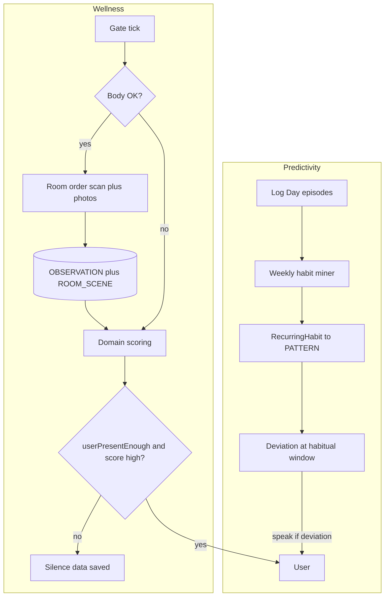
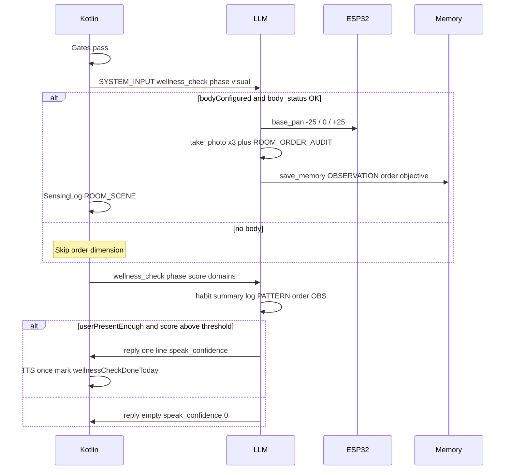

# Proactive Architecture — SSOT

**Target architecture** for user-facing proactivity: **Predictivity** + **Wellness**.  
Replaces the fragmented model of per-domain heartbeat triggers (`TimeDaily`, `EVENT nuova_foto`, round-robin in `AttentionDomainRepository`).

> **Runtime status:** Care domains run as Wellness toggles (not per-domain heartbeat schedules). See [HEARTBEAT_ARCHITECTURE.md](HEARTBEAT_ARCHITECTURE.md) for micro-tick / custom heartbeat shell.

---

## Overview

| Component | Talks to user? | Role |
|-----------|----------------|------|
| **Predictivity** | Yes (deviation prompts) | Learn recurring activities from Log Day; ask when habits break |
| **Wellness** | Yes (max 1 short line/day) | Daily check: score care domains; speak if one is clearly deficient |
| **Room order (visual)** | **No** | Input **for** Wellness only: body scan + photos + order assessment → stored |

**Not three channels.** Room order is **not** a separate proactive speak path — it is silent data collection inside the Wellness tick (when ESP32 body is available).



---

## Default constants

| Constant | Default | Meaning |
|----------|---------|---------|
| `N` (`wellnessAnchorMinutes`) | 60 | Minutes after **first hotword-on of the day** before Wellness tick is eligible |
| `idleMinutes` | 5 | Post-dialog buffer: do not start wellness while a conversation may still be ongoing |
| `W` (`wellnessPresenceMinutes`) | 15 | Presence fallback: recent user turn when body locate fails / no body (clamped ≥ idle) |
| `wellnessSpeakCapPerDay` | 1 | Max Wellness **spoken** lines per day (once-per-day check; independent of predictivity cap) |
| `predictivityPresenceMinutes` | 10 | Max minutes since last user turn for predictivity speak (without body locate) |
| `predictivityPromoteHitCount` | 7 | Distinct calendar days on same slot → confidence cap (~90%) |
| `predictivityMinHitCount` | 3 | Minimum slot hits before deviation speak is eligible |
| `predictivityMinConfidence` | 0.70 | Minimum slot confidence before deviation speak |
| `predictivityTimeToleranceMinutes` | 45 | ± window around `typicalTimeMinutes` for match and deviation |
| `predictivityPatternTtlDays` | 30 | TTL for `PATTERN` habit slots in unified memory |

Configurable in **Impostazioni → Proattività** (future UI).

---

## Channel 1 — Predictivity

### Purpose

Observe what the user **reports doing** (walk at 8:30 every day, treadmill at 19:00, lunch at parents on Saturdays, going out in the evening) and, over time:

1. Detect **repeating slots** (same normalized activity + same time band on different **calendar days**).
2. **Predict** expected behaviour via rising slot confidence.
3. **Interact** when behaviour deviates: e.g. "You usually walk the dog around 8:30 — not today?"

Does **not** use user-initiated photos or the Wellness tick.

### Input

- [`activity_log.db`](ACTIVITY_LOG.md) episodes: `label`, `dayKey`, `timestampMs`, `eventKind`, optional `scheduledAtMs`
- Capture: `log_daily_activity` tool + background `ActivityExtractionService` from `conversationLog`
- Miner reads only `PHYSICAL_NOW` + `CONFIRMED` for habit hits ( `PLAN` optional later for forward-looking patterns)

Log Day retention is **7 days**. Habit knowledge must live in **PATTERN** (30-day TTL), not in the log.

---

### Incremental miner (silent, catch-up)

**No fixed weekly schedule** — the app cannot rely on the user opening it at a specific time.

#### When to run

| Trigger | Required |
|---------|----------|
| App / voice session start | Process all pending days |
| **Before** `ActivityLogRepository.pruneExpired()` | **Mandatory** — never delete episodes that were not mined |
| After new episodic extraction (optional) | Same day only if new events on an already-mined day are impossible (see idempotency) |

#### Watermark

Persist in DataStore (e.g. `predictivity_mining_v1`):

| Field | Meaning |
|-------|---------|
| `lastMinedDayKey` | Last `yyyy-MM-dd` fully processed by the miner |

**Catch-up:** on each run, process every `dayKey` such that `dayKey > lastMinedDayKey` and `dayKey < today` (yesterday and all missed days). Optionally include **today** only after local end-of-day or on next app open (implementation choice: default **mine through yesterday** on open; today mined next open).

**No re-mining the same calendar day:** once `lastMinedDayKey` advances past a day, that day is never processed again. New events appended the same day after mining must be rare; if needed, only allow same-day re-run before midnight via `minedDayKey` not yet equal to today.

#### Pre-prune sequence (mandatory)

```text
1. minePendingDays()     // catch-up + update PATTERN slots
2. pruneExpired()        // delete activity_log older than 7 days
```

Patterns already promoted survive in `memory_documents` / PATTERN.

#### Label normalization (one LLM call per mining run)

Once per mining execution, batch all **raw labels** from pending days into **one** lightweight LLM call (`habit_label_normalize_prompt.txt`):

- Input: distinct labels from unmined days only
- Output: map `rawLabel → canonicalLabel`
- Rules: merge aliases ("passeggiata cane", "passeggiata Brina" → `passeggiata_cane`); do not invent labels absent from input

Kotlin applies the map before slot assignment. Cost is negligible (one call per app open / pre-prune, not per event).

---

### Habit slot model

A **slot** is one recurring schematic pattern:

```text
slotKey = canonicalLabel + "|" + timeBucketMinutes
```

| Part | Rule |
|------|------|
| `canonicalLabel` | From normalization pass |
| `timeBucketMinutes` | `timestampMs` rounded to bucket (default **30 min**, e.g. 08:32 → 510) |

**Same activity, same time, different calendar days** → **one slot**, `hitCount` increments (e.g. walk dog 08:30 Mon, Tue, Wed …).

**Do not** split by day-of-week in the slot key. Daily habits and weekly habits share the same model: a Tuesday-only treadmill accumulates one hit per Tuesday; confidence grows slower (~1 hit/week) until `predictivityMinHitCount` / `predictivityMinConfidence` are met.

Optional metadata on the slot (derived, not part of key): histogram of `dayOfWeek` for deviation tuning (future).

#### Per-day mining algorithm

For each pending `dayKey` D:

```text
for each episode E on D where kind = PHYSICAL_NOW and confidence = CONFIRMED:
  canonical = labelMap[E.label]
  slotKey = canonical + "|" + timeBucket(E.timestampMs)
  if slot already received a hit on dayKey D: skip   // max 1 hit per slot per calendar day
  load or create HabitSlot(slotKey)
  slot.hitCount += 1
  slot.lastHitDayKey = D
  slot.typicalTimeMinutes = rolling average of hit times
  slot.confidence = min(0.90, slot.hitCount * (0.90 / predictivityPromoteHitCount))
  slot.displayLabel = human label from canonical
  persist as save_memory PATTERN (structured value + TTL predictivityPatternTtlDays)
advance lastMinedDayKey to D
```

**Confidence examples** (`predictivityPromoteHitCount = 7`):

| Distinct days same slot | confidence |
|-------------------------|------------|
| 1 | ~13% |
| 3 | ~39% |
| 5 | ~64% |
| 7 | **90%** (cap) |

**Deviation speak eligibility:** `hitCount >= predictivityMinHitCount` **and** `confidence >= predictivityMinConfidence`.

#### Stored PATTERN shape (example)

```json
{
  "slotKey": "passeggiata_cane|510",
  "canonicalLabel": "passeggiata_cane",
  "displayLabel": "Passeggiata con il cane",
  "typicalTimeMinutes": 510,
  "timeToleranceMinutes": 45,
  "hitCount": 7,
  "lastHitDayKey": "2026-06-11",
  "confidence": 0.90,
  "source": "activity_log_miner"
}
```

`ActivityHabitSummarizer` prose remains for human recall — **not** SSOT for the deviation watcher.

---

### User feedback and habit removal

| User signal | Action |
|-------------|--------|
| Confirms skip ("sì oggi salto") | OBSERVATION; optional temporary suppress for today |
| Denies deviation ("l'ho già fatto") | Improve logging / extraction; no penalty |
| **"Non lo faccio più" / "non è più un'abitudine"** | **`delete_memory`** on matching PATTERN slot (or all slots for topic) |
| Pattern absent for long period | Future: decay (out of scope v1) |

Voice or explicit forget flows must remove the slot so deviation stops.

---

### Deviation watcher (runtime)

**When:** current time in `[typicalTimeMinutes ± predictivityTimeToleranceMinutes]` for an eligible slot **and**:

- Mic / hotword session active
- Robot context not SILENT (WORK / CALL / MEETING / FOCUS)
- Proactive cap / cooldown respected
- `predictivityUserPresentEnough` (see below)
- No matching episode **today** (`dayKey` = today, same `canonicalLabel`, time within tolerance)

**If** deviation candidate → short question, low–medium `speak_confidence`, curious tone.

#### Predictivity presence (baseline)

Evaluated **at deviation window**, not at weekly schedule:

```text
predictivityUserPresentEnough =
  lastUserTurnWithin(predictivityPresenceMinutes)   // default 10 min
  OR (bodyOk && locateUserNow())                    // silent pan + face / detect_presence
```

- **Body connected alone** ≠ presence.
- Without body and no user turn in 10 min → **silence** (no deviation speak).

---

### Kotlin vs LLM

| Kotlin | LLM |
|--------|-----|
| Watermark, catch-up days, pre-prune order, slot keys, hitCount, confidence, gates, deviation window | One batch label normalize per mining run; deviation phrasing |

### Source files (target)

| File | Role |
|------|------|
| `ActivityLogRepository` | Episodes; **mine before** `pruneExpired()` |
| `ActivityHabitSummarizer` | Legacy narrative summary (recall only) |
| *Future:* `RecurringHabitSlotMiner`, `HabitSlotRepository`, `DeviationWatcher` | Incremental mining + runtime |

---

## Channel 2 — Wellness

### Purpose

Once per day (when gates pass), run a **unified check**:

1. Optionally capture **room order** (body only).
2. Score care domains: meals, workload, movement, social contacts, **order** (if data available).
3. Speak **at most one** short sentence if the top domain is clearly deficient and presence allows.

**Silence is the default** (80–95% of ticks).

### Timing gates (Kotlin)

All must pass before `SYSTEM_INPUT: wellness_check`:

| Gate | Rule |
|------|------|
| Wellness enabled | `ProactivitySettings.wellnessEnabled` (**not** micro-tick / `HeartbeatSettings.enabled`) |
| Mic active | Hotword / voice session active **at check time** |
| Not busy | No Thinking/Speaking/ActiveListening/CapturingImage; LLM idle |
| Night | Suppressed |
| Robot context | Not SILENT profile ([`RobotContextPolicy`](../app/src/main/java/com/example/mydeskrobot/domain/context/RobotContextPolicy.kt)) |
| Daily anchor | `now - firstHotwordOnToday >= N` minutes |
| Idle buffer | No user voice turn for `idleMinutes` (anti-overlap with dialog) |
| Presence | Body configured+reachable → `locateUser` first; if miss → recent turn within `W` (≥ idle). No body → recent turn only |
| Once per day | `wellnessCheckDoneToday` / `wellnessVisualDoneToday` marked **after** successful tick (not before dispatch) |

**Independent from predictivity** speak gates (daily cap 3 / cooldown 20).  
**Not** gated on ML Kit `DeskPresenceGate` for starting the tick.

### Wellness pipeline (four phases)



#### Phase 1 — Gate (Kotlin only)

Schedule: poll every ~5 min while mic active (same loop as mood monitor), or integrate into existing heartbeat alarm with Wellness-specific selector.

#### Phase 2 — Visual order (conditional)

**Prerequisite:** [`BodySettings.isConfigured()`](../app/src/main/java/com/example/mydeskrobot/data/body/BodySettingsRepository.kt) **and** `body_status` reachable.

**Not** required: ML Kit presence, user dialog photos.

**Actions (mandatory 3-angle scan — once/day cost accepted):**

- `base_pan` ≈ **−25 / 0 / +25**, each followed by `take_photo` (one sector per chain turn; planner-driven).
- Dedicated playbook [`room_order_audit_prompt.txt`](../app/src/main/assets/prompts/room_order_audit_prompt.txt) (`ROOM_ORDER_AUDIT`).
- Evaluate clutter/order only — **no** object inventory, no entity catalog, no spatial landmark identity.
- **Judgment in OBSERVATION is objective** (call disorder what it is; level `ordinato` | `disordinato` | `molto_disordinato`). Soft wording is for phase 4 speak only.
- `save_memory` OBSERVATION with dated order summary after all three angles.
- `SensingLogRepository.record(SensingKind.ROOM_SCENE)`.

**Without body:** skip phase 2; Wellness scores text-only domains.

#### Phase 3 — Domain scoring

Inputs:

| Domain | Signals |
|--------|---------|
| Meals | Habit summary, today's PHYSICAL_NOW meals, PATTERN lunch times |
| Workload | Late sessions, weekend work episodes, PATTERN |
| Movement | Missing walk/gym vs PATTERN, habit summary |
| Social | SOCIAL_THREAD episodes, weekly PATTERN |
| Order | Fresh OBSERVATION from phase 2 only |

Kotlin may pre-compute scores; LLM formulates final message from injected context.

#### Phase 4 — Speak (optional)

Speak only if:

- `userPresentEnough` (see below)
- Top domain score > threshold
- `speak_confidence` ≥ proactive threshold
- `wellnessSpeakCapPerDay` not exceeded

**Exposure tone:** soft, non-imperative, non-shaming — even when the stored order judgment is objectively `disordinato` / `molto_disordinato`. Soft speak ≠ soft facts.

Otherwise: silence; phase 2 data still persisted.

### Wellness domains vs attention domain toggles

Care domains in [`AttentionDomainRepository`](../app/src/main/java/com/example/mydeskrobot/data/heartbeat/AttentionDomainRepository.kt) (`pasti`, `carico_lavoro`, `attivita_fisica`, `contatti_sociali`, `ordine_ambiente`) and **user custom domains** (name + prompt) are **not** separate scheduled triggers. They are **toggleable scopes** for the unified Wellness check:

| Domain id | Role in Wellness |
|-----------|------------------|
| `pasti` / `carico_lavoro` / `attivita_fisica` / `contatti_sociali` | Scored in `DOMAIN_SCORE` when enabled |
| `ordine_ambiente` | When enabled: silent `VISUAL_ORDER` **before** score (body required); then scored from fresh OBS |
| `custom_*` (user-authored) | Scored in `DOMAIN_SCORE` using the user prompt; same engagement gates as built-ins |

Room identity (`set_current_place` / spatial SSOT) is **not** an attention domain. Do not fire heartbeat ticks on place change.

---

## Room order — input for Wellness (not a channel)

| Rule | Detail |
|------|--------|
| User dialog photos | **Never** reused for order assessment |
| `EVENT nuova_foto` | **Deprecated** — remove fire from `ConversationViewModel` on user `take_photo` |
| `ordine_ambiente.txt` as standalone heartbeat domain | **Removed** — order is Wellness phase `VISUAL_ORDER` then score |
| Prompt | `ROOM_ORDER_AUDIT` — distinct from [`FreshVisionVerifyPrompt`](../app/src/main/java/com/example/mydeskrobot/reasoning/memory/FreshVisionVerifyPrompt.kt) (dialog "what do you see") |
| Body required | Phone-only fixed front camera cannot pan — order dimension skipped |
| User interaction | None required; no TTS from order phase alone |

### Stored shape (OBSERVATION example)

```
12 giugno 2026: scrivania disordinata — tazze e fogli sparsi; ordine: disordinato
```

Optional structured fields in future Kotlin DTO: `orderLevel` = `ordinato` | `disordinato` | `molto_disordinato`.

---

## UserPresencePolicy

Replaces ML Kit `DeskPresenceGate` for proactive **speak / start** paths.

### Wellness (body first)

```text
if bodyConfigured && bodyReachable:
  locateUserNow() OR lastUserTurnWithin(max(W, idle) minutes)
else:
  lastUserTurnWithin(max(W, idle) minutes)   // default W=15, idle=5
```

Idle buffer (do not start right after a dialog) is a **separate** scheduling gate from presence.

### Predictivity (baseline)

```text
predictivityUserPresentEnough =
  lastUserTurnWithin(10 minutes)
  OR (bodyOk && locateUserNow())
```

Evaluated at **deviation window** time. Body locate = on-demand scan (pan + face), not "ESP32 online".

| Action | Wellness presence | Predictivity presence | Requires body? |
|--------|-------------------|----------------------|----------------|
| Wellness tick (visual + score) | Yes (locate first, else turn ≤W) | — | Locate preferred |
| Predictivity deviation TTS | — | Yes (10 min OR locate) | Locate only |

### Scenario table

| Scenario | Wellness start | Predictivity speak |
|----------|----------------|-------------------|
| Spoke 8 min ago, no body (idle≥5, W=15) | Yes | Yes |
| Spoke 30 min ago, body finds user | Yes | Yes |
| Spoke 30 min ago, no body | No | No |
| Mic on, never spoke, body scan empty | No | No |

ML Kit [`DeskPresenceMonitor`](DESK_PRESENCE.md) remains for conversational centering and debug — not mandatory gate for Wellness.

---

## Predictivity vs Wellness

| | Predictivity | Wellness |
|--|--------------|----------|
| Trigger | Habitual time window | T+N after first hotword-on + idle + presence |
| Enable switch | `predictivityEnabled` | `wellnessEnabled` |
| Data | Log Day episodes | Habit summary, log, PATTERN, order OBS |
| Photos | Never | Only room order in Wellness tick (body) |
| Speak | Deviation question (cap/cooldown shared among predictivity speaks) | At most one care line / day |
| Presence | 10 min turn OR body locate | Body locate first, else turn ≤W |
| Mining | Incremental catch-up + pre-prune | — |

`HeartbeatSettings.enabled` = **micro-tick alarm only** (eyes/body look-around, no LLM).

---

## Migration from legacy heartbeat

| Legacy | Target |
|--------|--------|
| `DomainScheduler` round-robin + `TimeDaily` / `EVENT` triggers for care domains | Single Wellness scheduler; care domains = toggles only |
| `EVENT nuova_foto` → `ordine_ambiente` | Removed |
| `onDomainEvent("nuova_foto")` / `cambio_stanza` as attention domain | Removed from care path; room identity via spatial SSOT only |
| `ProactiveGatePolicy` + ML Kit for all proactive | ML Kit optional; `UserPresencePolicy` for Wellness speak |
| `assets/prompts/domains/*.txt` per tick | Care prompts optional reference; runtime uses `wellness_check_prompt.txt` + `room_order_audit_prompt.txt` |
| `HEARTBEAT_PLAYBOOK` on domain ticks | `WELLNESS_CHECK` / room-order prompts for Wellness; playbook only for remaining custom heartbeat ticks |
| Heartbeat MICRO tick (bored look-around) | **Keep** — zero LLM, separate from Wellness |
| Critic pass (HIGH domains) | **Removed** — superseded by Wellness/Predictivity gates + `speak_confidence` |
| `weekly_reflection` | Keep; complement Predictivity miner (robot stats vs user habits) |

### Code references (migration complete for care domains)

- [`AttentionDomainRepository.kt`](../app/src/main/java/com/example/mydeskrobot/data/heartbeat/AttentionDomainRepository.kt) — care catalog + toggles; `enabledCareDomainIds()` / `enabledHeartbeatDomains()`
- [`WellnessWatcher.kt`](../app/src/main/java/com/example/mydeskrobot/integration/wellness/WellnessWatcher.kt) — `VISUAL_ORDER` before `DOMAIN_SCORE` when order enabled
- Spatial place change no longer emits attention-domain events

---

## Future prompt assets

| Label | Asset | Injected when |
|-------|-------|---------------|
| `WELLNESS_CHECK` | `wellness_check_prompt.txt` | `SYSTEM_INPUT: wellness_check` |
| `ROOM_ORDER_AUDIT` | `room_order_audit_prompt.txt` | Wellness tick phase 2 (vision turn) |
| `HABIT_LABEL_NORMALIZE` | `habit_label_normalize_prompt.txt` | One batch call per incremental mining run |

See [PROMPT_PHILOSOPHY.md](PROMPT_PHILOSOPHY.md).

---

## Implementation phases (roadmap)

See [TODO.md](TODO.md) § H7 — Predictivity + Wellness.

1. **Docs** (this file) — done
2. **Wellness:** `UserPresencePolicy`, Wellness scheduler, unified system input, prompts, WorkingMemory flags
3. **Predictivity:** `RecurringHabitSlotMiner` (catch-up + pre-prune), PATTERN slots, `DeviationWatcher`
4. **Cleanup:** settings UI labels aligned; care domains no longer scheduled on heartbeat; custom domains optional on heartbeat

---

## Related docs

- [ACTIVITY_LOG.md](ACTIVITY_LOG.md) — Predictivity input
- [BODY_INTEGRATION.md](BODY_INTEGRATION.md) — Room order scan
- [DESK_PRESENCE.md](DESK_PRESENCE.md) — ML Kit vs `UserPresencePolicy`
- [ROBOT_CONTEXT.md](ROBOT_CONTEXT.md) — WORK/CALL silence
- [HEARTBEAT_ARCHITECTURE.md](HEARTBEAT_ARCHITECTURE.md) — Legacy runtime (superseded for domains)
- [PROMPT_PHILOSOPHY.md](PROMPT_PHILOSOPHY.md) — Prompt labels
- [guides/PROATTIVITA.md](guides/PROATTIVITA.md) — Human overview (IT)
