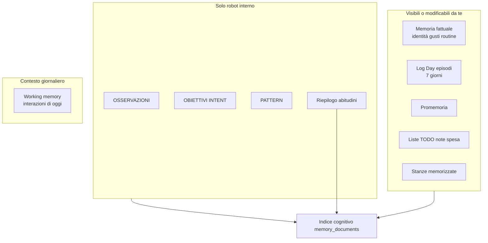
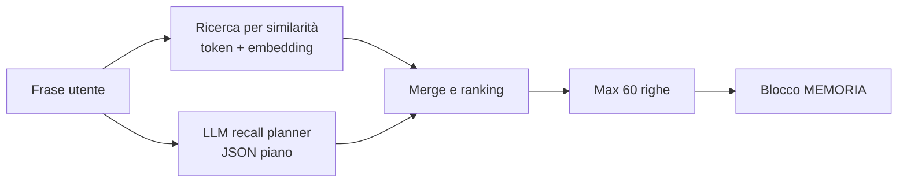

# Guida alla memoria del robot

> **Per sviluppatori e agenti AI:** contratto tecnico in [MEMORY.md](../MEMORY.md) e [MEMORY_ACCESS.md](../MEMORY_ACCESS.md).  
> **Dettaglio implementativo:** [MEMORIA_TECNICA.md](MEMORIA_TECNICA.md).

Il robot non ha una sola “memoria”: ha **diversi tipi di informazione** con scopi e durate diverse. In dialogo vocale, però, la maggior parte converge in un unico blocco **MEMORIA** nel prompt del LLM — l’agente cognitivo sceglie cosa usare in base alla domanda.

---

## 1. Panoramica: i tipi di memoria



| Tipo | Cosa contiene | Durata tipica | Dove la vedi |
|------|---------------|---------------|--------------|
| **Memoria fattuale** | Nome, professione, orari lavoro, gusti, fatti stabili | Permanente (fino a delete/reset) | Impostazioni → Memoria |
| **Episodi (Log Day)** | Pasti, attività, messaggi WhatsApp, piani | ~7 giorni | Impostazioni → Log Day |
| **Promemoria** | “Ricordami alle 18 di…” | Fino a scadenza/cancellazione | Recall vocale, allarme |
| **Liste** | TODO, note, spesa | Fino a completamento/rimozione | Tool `list_items` |
| **Spaziale** | Stanze e landmark | Permanente | Impostazioni → Stanze; blocco DOVE SONO |
| **Autonomia** | Osservazioni, obiettivi, pattern del heartbeat | TTL (1–30 giorni) | Non in Settings |
| **Working memory** | Quante volte hai parlato oggi, topic già discussi | Reset a mezzanotte | Solo heartbeat |

**Messaggio chiave:** sotto il cofano esiste un **indice unificato** (`memory_documents.db`) che il robot usa per il dialogo. I database “operativi” (log attività, promemoria, liste, stanze) restano la fonte per azioni concrete (allarmi, checkbox, ecc.), ma vengono **proiettati** nell’indice così il LLM può richiamarli con una sola domanda vocale.

---

## 2. Memoria fattuale

Sono i **fatti su di te** che il robot dovrebbe ricordare tra una settimana e l’altra.

### Categorie

| Categoria | Esempi |
|-----------|--------|
| **IDENTITY** | Nome, professione (“sviluppatore web”), ruolo |
| **PREFERENCE** | Sport che segui (MotoGP), musica, cibi preferiti |
| **ROUTINE** | Orari di lavoro (lun 9–13 / 14–18, ven 9–13), abitudini ricorrenti |
| **FACT** | Altri fatti stabili (nome del cane, allergie, …) |

### Come si aggiorna

1. **Durante il dialogo** — il LLM può chiamare il tool `save_memory` quando capisce che stai dicendo qualcosa di duraturo (“ricorda che il venerdì lavoro fino alle 13”).
2. **Estrazione automatica** — in standby (hotword attivo), un job in background legge il log della conversazione, estrae fatti con un LLM dedicato e li salva. Intervallo configurabile in **Impostazioni → Memoria** (default 45 secondi).
3. **Modifica manuale** — in **Impostazioni → Memoria** puoi editare, salvare o eliminare ogni riga.
4. **Salvataggio** — duplicati si **aggiornano** solo su **match esatto** (stessa categoria + stesso testo normalizzato). Parafrasi o omonimi (nome utente vs contatto) restano righe separate fino a **Riorganizza** (LLM). Per ROUTINE, giorni diversi (lun–gio vs venerdì) restano sempre righe separate anche in consolidation (`RoutineWeekdayScope`).

### Memoria in dialogo (LLM + tool)

| Intento | Percorso |
|---------|----------|
| **“cosa sai di me”** / **“ripeti tutto quello che sai”** | Planner `GENERAL` (non `USER_FACTS`) + `WEEK` + episodi recenti + abitudini → MEMORIA → LLM sintetizza tutte le sezioni |
| **“dimentica …”** / “va bene allora dimentica X” | Planner `skip_recall` se il topic è nella frase → LLM → tool `delete_memory` |
| **“ricordati che …”** | LLM → `save_memory` |
| **Reset totale** | Solo **Impostazioni → Memoria** (non comando vocale) |

Nessun bypass Kotlin: stesso ingresso `sendPhraseToLlm` per tutte le frasi (salvo shortcut notifiche/debug documentati altrove).

### Cosa non compare in Impostazioni → Memoria

- **OBSERVATION**, **INTENT**, **PATTERN** — memoria interna heartbeat; non in Settings.
- **Episodi Log Day** e **PROFILO ABITUDINI** — visibili in Log Day / recall dialogo, non in questa lista.

---

## 3. Log Day ed episodi

Il **Log Day** è la timeline di **cosa succede nella tua giornata**: pasti, passeggiate, messaggi, impegni futuri. Non è memoria fattuale permanente.

### Differenza fondamentale

| Situazione | Dove va |
|------------|---------|
| “Oggi ho pranzato alle 13” | Episodio Log Day (si dimentica dopo ~7 giorni) |
| “Il venerdì pranzo sempre alle 13” | Memoria fattuale ROUTINE (`save_memory`) |
| “Domani devo andare dal dentista” | Episodio PLAN o TODO, non ROUTINE |

### Come si popola

- Tool **`log_daily_activity`** durante il dialogo
- **Estrattore episodico** in standby (come la memoria fattuale, ma con prompt diverso)
- **Notifiche** (es. WhatsApp) quando il microfono è attivo e la notifica viene accettata → episodio con flag **non letto**

### Log Day in UI vs voce

- **Impostazioni → Log Day** — lista completa degli eventi nel database operativo `activity_log.db`
- **Voce** (“cosa ho fatto ieri”, “chi mi ha scritto”) — recall dall’**indice unificato**, con budget e filtri temporali

Possono sembrare diversi se la domanda vocale non attiva il giusto **scope temporale** o se il riepilogo abitudini “copre” il dettaglio episodico (vedi FAQ).

### Notifiche non lette

Le notifiche accettate creano episodi con `isUnread=true`. In dialogo compaiono nella sezione **NOTIFICHE_NON_LETTE** del blocco MEMORIA. Dopo lettura o “segna come lette”, spariscono da quella sezione (restano negli EPISODI archiviati se ancora nel periodo di retention).

---

## 4. Promemoria, liste e abitudini

### Quando usare quale canale

| Informazione | Tool / canale | Perché |
|--------------|---------------|--------|
| Fatto che resta vero per settimane | `save_memory` | Profilo utente |
| Task da fare (anche “domani”) | `add_list_item` TODO | Azione, non identità |
| Nota libera / appuntamento scritto | `add_list_item` NOTE | Registro testuale |
| Spesa | `add_list_item` SHOPPING | Lista con checkbox |
| Avviso a un’ora precisa | `set_reminder` | Il robot parla/notifica a scadenza |

**Regola pratica:** se dici solo “ricorda” ma è un compito una tantum → **non** è memoria fattuale. Se è ricorrente (“ogni martedì…”) → **ROUTINE** in `save_memory`.

### Riepilogo abitudini (PROFILO ABITUDINI)

Periodicamente il sistema genera un **testo sintetico** delle tue abitudini (es. “colazione verso le 8, pausa pranzo verso le 13”) a partire dagli episodi. Compare nel blocco MEMORIA come **PROFILO ABITUDINI** solo se il **recall planner** imposta `include_habit_summary: true` (domande ampie su abitudini o periodi — non automatico su ogni “questa settimana”).

È utile per risposte generali, ma può **affogare** il dettaglio se chiedi qualcosa di specifico (es. un allenamento su tapis roulant) senza parole che attivano il recall episodico mirato.

---

## 5. Memoria spaziale

Riguarda **in quale stanza** si trova il telefono/robot (studio, cucina, …), non la navigazione GPS.

- Domande come **“dove siamo?”**, **“che stanze conosci?”** usano spesso un blocco dedicato **DOVE SONO**, non solo MEMORIA.
- Le stanze si memorizzano con foto e landmark (`save_place`, `analyze_room_scene`, …).
- In **Impostazioni → Stanze** puoi vedere e modificare i luoghi salvati.

Dettaglio tool e soglie di match: [SPATIAL_MEMORY.md](../SPATIAL_MEMORY.md).

---

## 6. Memoria autonoma (heartbeat)

Il tick **heartbeat** è il ragionamento autonomo periodico del robot (silenzio di default, interventi brevi se utili).

Il robot può salvare per sé:

| Categoria | TTL default | Scopo |
|-----------|-------------|--------|
| **OBSERVATION** | 7 giorni | Nota contestuale datata (“utente ancora al lavoro alle 20:15”) |
| **INTENT** | 1 giorno | Obiettivo attivo (max 3), es. “intervieni se salta il pranzo alle 13:30” |
| **PATTERN** | 30 giorni | Schema emergente non ancora promosso a ROUTINE |

Questi dati entrano nel payload `[SYSTEM_INPUT: heartbeat]` come **OBIETTIVI ATTIVI**, **OSSERVAZIONI RECENTI**, **PATTERN EMERGENTI** — non nel blocco MEMORIA del dialogo vocale normale.

Il heartbeat legge anche fino a **5 routine** dalla memoria fattuale e il riepilogo abitudini, ma **non** l’intera lista fatti.

Visione complessiva: [AUTONOMOUS_AGENT_VISION.md](../Drafts/AUTONOMOUS_AGENT_VISION.md).

---

## 7. Impostazioni → Memoria (walkthrough)

Percorso: **ingranaggio** (basso a sinistra) → **Memoria**.

### Configurazione estrazione e Riorganizza

- **Switch estrazione** — attiva/disattiva l’estrazione automatica dal log conversazione
- **Intervallo (secondi)** — ogni quanto controllare nuove righe in standby (10–300; default 45)
- **Riorganizza automaticamente** — in standby, valuta gate (min righe + cooldown + LLM) e lancia compattazione LLM + prune
- **Minimo righe per Riorganizza** — default 100 (10–500)
- **Giorni tra Riorganizza** — default 7 (1–90)
- Pulsante **Salva** (in basso al dialog) — salva tutte le preferenze sopra in DataStore

L’**auto Riorganizza** gira a ogni ciclo standby dello scheduler estrazione (anche se l’estrazione è disattivata), non richiede il pulsante manuale.

### Lista fatti editabili

All’apertura del dialog viene caricata la memoria fattuale attiva (`IDENTITY`, `PREFERENCE`, `ROUTINE`, `FACT`).

Per ogni riga:
- Etichetta `CATEGORIA · #id`
- Campo testo modificabile
- **Salva** — aggiorna quella riga nel database
- **Elimina** — soft-delete

Le modifiche al testo **non** si salvano da sole: serve **Salva** sulla singola riga.

### Azioni globali

| Pulsante | Cosa fa |
|----------|---------|
| **Reset memoria** | Cancella tutti i fatti utente visibili; resetta il cursore estrazione; **non** tocca memoria autonoma robot |
| **Riorganizza ora** | Stessi gate dell’auto (min righe + cooldown + LLM): compattazione LLM + eventuale prune oltre 300. L’**auto** parte in standby se abilitata in impostazioni |

**Riorganizza** compatta duplicati e frammenti simili via LLM quando i gate sono soddisfatti (anche **in automatico** in standby, se abilitato), poi taglia l’eccedenza oltre 300 righe. Minimo righe e giorni di cooldown si configurano in Impostazioni → Memoria (default 100 e 7).

**Pinned:** il robot può marcare fatti critici (`pinned: true` su `save_memory`) — nome utente, allergie, emergenze, “ricordalo sempre”. Non si inferisce il pin da contatti WhatsApp o omonimi.

---

## 8. Come il robot usa la memoria in dialogo

Ogni turno vocale il sistema recupera informazioni dall’**indice unificato** (`memory_documents.db`) e le mette nel prompt del LLM come blocco **MEMORIA**. Non è una lettura casuale né “le ultime 60 righe”: è un **retrieval per rilevanza** (RAG), con un tetto di **60 documenti** dopo il ranking.

### I due livelli del recall



| Livello | Cosa fa | Senza di esso |
|---------|---------|----------------|
| **RAG** (sempre) | Confronta la domanda con ogni riga dell’indice (parole in comune +, se disponibile, vettori ONNX). Le più **vicine** alla domanda salgono in cima. | — |
| **Analisi frase** (planner LLM) | Capisce *che tipo* di domanda è e produce un piano JSON (`recall_focus`, `search_queries`, tempo, …). | Senza piano valido il turno **fallisce** (nessun fallback con regole Kotlin). |

L’analisi **non** sceglie un altro database: **parametrizza** il retrieval sullo stesso indice unificato.

### Passo 1 — Piano di recall (LLM leggero, non il LLM del dialogo)

Codice: `LlmMemoryRecallPlanner` + prompt `memory_recall_planner_prompt.txt`. Una chiamata LLM **solo planning** per turno vocale; output **solo JSON** (nessuna risposta all’utente).

| Campo piano | Esempi nella domanda | Effetto |
|-------------|---------------------|---------|
| **skip_recall** | saluti, ack, comandi azione diretti (luce, volume, …), save/delete con topic già in frase | Nessun blocco MEMORIA — non è un errore |
| **temporal_scope / focus_day_key** | ieri, oggi, questa settimana | Carica episodi/promemoria del giorno o range |
| **recall_focus** | USER_FACTS, EPISODIC, MESSAGES, PLANNING, SPATIAL, GENERAL | Attiva preferenze ranking e filtri pool |
| **search_queries** | 1–4 frasi italiane espresse come in MEMORIA | Ricerca semantica multi-query (parafrasi incluse) |
| **include_habit_summary** | domande ampie su abitudini | Pinna PROFILO ABITUDINI solo se `true` |
| **localize_spatial** | dove siamo, che stanza | Stanze **fuori** da MEMORIA → blocco **DOVE SONO** |

Eccezione: dopo `take_photo` in catena il piano è **deterministico** (`visionCatalog`) senza chiamata planner.

### Passo 2 — Recupero dall’indice (RAG + regole)

1. **Ricerca per similarità** — la domanda viene confrontata con le righe attive (token + embedding ibrido se il modello è scaricato).
2. **Pin e filtri dal piano** — es. notifiche non lette sempre in cima; episodi del giorno se `SINGLE_DAY`; fatti in cima se `recall_focus=USER_FACTS`.
3. **Budget** — massimo **60** righe dopo il ranking (non un campione casuale).

### Passo 3 — “Formatta” = testo leggibile per il LLM

Le righe dal database sono record strutturati (id, kind, category, value, date). `RecallContextFormatter` le trasforma in **testo con sezioni**:

```
MEMORIA (usa ciò che serve per la domanda; ignora il resto):
Contesto giorno: ieri 18 giugno 2026

EPISODI:
- 13:05 pranzo

FATTI:
1. (ROUTINE) Lunedì lavora dalle 9:00 alle 13:00...
2. (IDENTITY) L'utente è sviluppatore web
```

Sezioni possibili: NOTIFICHE_NON_LETTE, EPISODI, PROMEMORIA, LISTE, SPAZIO, PROFILO ABITUDINI, FATTI.

### Passo 4 — Il LLM risponde

Legge il blocco MEMORIA (e eventuali altri blocchi: DOVE SONO, mood, …) e genera la risposta. Può ancora chiamare tool come `list_memories` se il contesto non basta.

### Cosa significa “recall dedicato ai fatti utente”

Quando il piano ha **`recall_focus: USER_FACTS`** (es. “che lavoro svolgo”, “orari di lavoro”, “che motorsport seguo”):

1. **`search_queries`** — il planner espande parafrasi (“che lavoro” → anche professione, sviluppatore, …); ogni query esegue rank sui fatti user-facing e si tiene il **max score** per documento.
2. **Esclusioni** — episodi e riepilogo abitudini **non** riempiono il pool di ricerca generica.
3. **`include_habit_summary`** — il riepilogo abitudini viene pinato solo se il planner lo imposta esplicitamente a `true`.

Se il planner fallisce (JSON invalido, LLM non configurato, …) il turno vocale termina con errore — **nessun** recall nascosto con regole Kotlin.

### Stanze

Domande come “dove siamo” / “che stanze conosci” usano il blocco spaziale **DOVE SONO**, non solo MEMORIA.

Dettaglio implementativo: [MEMORIA_TECNICA.md](MEMORIA_TECNICA.md).

---

## 9. FAQ e troubleshooting

### “Cosa sai di me” e domande ampie

Passano dal **recall planner** (`recall_focus: GENERAL`, parafrasi in `search_queries`, spesso `include_habit_summary`) e dal blocco MEMORIA — non più un elenco fisso di 8 fatti. Per la timeline giornaliera chiedi anche “cosa ho fatto ieri?” o apri **Impostazioni → Log Day**.

### Il robot parla di abitudini generiche invece dei miei orari di lavoro

Gli orari sono in memoria fattuale **ROUTINE**. Se la domanda è vaga o il recall privilegia il PROFILO ABITUDINI, la risposta può essere generica. Verifica che le righe ROUTINE siano in **Impostazioni → Memoria** e riprova con domande esplicite (“dimmi gli orari di lavoro”, “che orario faccio il venerdì”).

### Log Day mostra più messaggi della voce

Stesso indice, ma recall vocale con **budget** (max 60 righe) e **filtri** (giorno, settimana, tipo domanda). Prova con ancoraggio temporale: “ieri”, “venerdì”, “nell’ultimo periodo”.

### “Non ho informazioni” su qualcosa che è in Memoria Settings

Possibile disallineamento **parafrasi**: la domanda (“che lavoro svolgo”) e il testo salvato (“sviluppatore web”) non condividono parole. Il recall recente espande sinonimi per le domande su lavoro/sport/orari; se persiste, riformula o verifica che il fatto sia nella categoria giusta.

### Linguaggio di programmazione sì, professione no

Stesso meccanismo: alcune coppie query/memoria matchano meglio per token comuni. Controlla categoria IDENTITY vs FACT; parafrasi duplicate restano righe separate finché non scatta **Riorganizza** (auto o manuale, gate min righe + cooldown configurabili). Per omonimi (nome utente vs contatto) verifica che non siano state fuse al save — il merge al salvataggio è solo su testo identico.

### Reset memoria vs dimentica

- **Reset** — solo **Impostazioni → Memoria** (tutto il profilo utente visibile)
- **Dimentica X** — voce naturale → LLM → `delete_memory` con topic
- Nessuno dei due cancella INTENT/OBSERVATION del heartbeat

### Estrazione non salva nulla

Controlla: estrazione **abilitata**, app in **standby** (hotword), LLM **configurato**, log conversazione non vuoto. Task one-off (“domani devo…”) vengono **ignorati** dall’estratore di memoria fattuale di proposito.

---

## 10. Per approfondire

| Documento | Contenuto |
|-----------|-----------|
| [MEMORIA_TECNICA.md](MEMORIA_TECNICA.md) | Flussi read/write, file sorgente, budget recall |
| [MEMORY.md](../MEMORY.md) | Spec memoria utente (inglese, agenti) |
| [MEMORY_ACCESS.md](../MEMORY_ACCESS.md) | Contratto accesso unificato, write path |
| [ACTIVITY_LOG.md](../ACTIVITY_LOG.md) | Log Day, tipi episodio |
| [SPATIAL_MEMORY.md](../SPATIAL_MEMORY.md) | Stanze e localizzazione |
| [MEMORY_EMBEDDING.md](../MEMORY_EMBEDDING.md) | Ricerca semantica ONNX |
