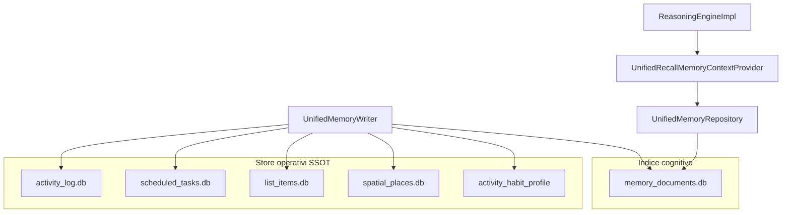
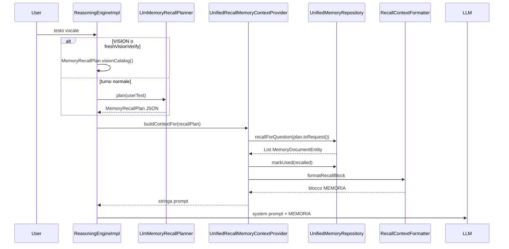

# Memoria — guida tecnica (agente cognitivo)

> Panoramica funzionale: [MEMORIA.md](MEMORIA.md).  
> Contratti SSOT (inglese): [MEMORY.md](../MEMORY.md), [MEMORY_ACCESS.md](../MEMORY_ACCESS.md).

Questo documento descrive **come** la memoria è cablata nel ragionamento del robot: store, proiezioni, recall vocale, assembly del prompt. Destinato a chi legge o modifica il codice Kotlin.

---

## 1. Architettura a due livelli

Il sistema separa **dati operativi** (fonte per esecuzione) da **indice cognitivo** (fonte per il LLM).



### Kind nell’indice (`MemoryDocumentKind`)

Definiti in `app/src/main/java/com/example/mydeskrobot/memory/unified/MemoryDocumentKind.kt`:

| Kind | Contenuto tipico |
|------|------------------|
| `USER_FACT` | Memoria fattuale (IDENTITY, PREFERENCE, ROUTINE, FACT); colonna opzionale `isPinned` |
| `EPISODE` | Proiezione Log Day / notifiche |
| `REMINDER` | Proiezione promemoria |
| `LIST_ITEM` | Proiezione liste |
| `SPATIAL` | Proiezione stanze |
| `AUTONOMY` | OBSERVATION, INTENT, PATTERN |
| `HABIT_SUMMARY` | Riepilogo abitudini testuale |

### Regola di scrittura

Ogni fatto **recallabile in dialogo** da store operativo deve passare da `UnifiedMemoryWriter` nella stessa `suspend`:

1. Scrittura store operativo
2. Scrittura proiezione in `memory_documents.db` (obbligatoria)
3. Su fallimento indice: log + `recordProjectionDrift()`

Eccezione: `USER_FACT` via `SaveMemoryTool` scrive **solo** l’indice (nessun store operativo parallelo).

Dettaglio tabella canali: [MEMORY_ACCESS.md](../MEMORY_ACCESS.md).

---

## 2. Assembly del prompt (turno vocale)

`ReasoningEngineImpl.buildPromptWithContext` risolve un `MemoryRecallPlan` (LLM planner o deterministico VISION), poi concatena sezioni condizionali al system prompt base.

| Sezione | Provider | Quando |
|---------|----------|--------|
| Tools + `llm_system_prompt.txt` | sempre | ogni turno |
| `body_capabilities` | `BodyCapabilitiesProvider` | se ESP32 configurato |
| `heartbeat_playbook` | `HeartbeatPlaybookProvider` | solo `[SYSTEM_INPUT: heartbeat]` / weekly |
| `DOVE SONO` | `SpatialContextProvider` | `plan.localizeSpatial` o vision verify |
| **MEMORIA** | `UnifiedRecallMemoryContextProvider` | turno utente con `recallPlan` non null |
| Contesto robot / mood | rispettivi provider | se presenti |

**Nota heartbeat:** il tick autonomo **non** usa il recall planner sulla frase utente. Il contesto memoria arriva da `HeartbeatContextBuilder` nel payload `RobotInput.Heartbeat`.

---

## 3. Read path — recall unificato (dialogo)

### Sequenza



### Step 1 — Piano dalla domanda

`LlmMemoryRecallPlanner` (`integration/memory/`) chiama LLM con `memory_recall_planner_prompt.txt` e parse JSON in `MemoryRecallPlan` (`reasoning/memory/`).

| Campo piano | Esempi |
|-------------|--------|
| `temporalScope` / `focusDayKey` | “ieri” → SINGLE_DAY + ISO date |
| `recallFocus` | USER_FACTS, EPISODIC, MESSAGES, PLANNING, SPATIAL, GENERAL |
| `searchQueries` | 1–4 frasi italiane per RAG multi-query |
| `includeHabitSummary` | true solo per domande ampie su abitudini |
| `localizeSpatial` | “dove siamo”, “che stanza” |

Su failure → `ReasoningResult.Error` (nessun fallback). Spec: [MEMORY_RECALL_PLANNER.md](../MEMORY_RECALL_PLANNER.md).

### Step 2 — Provider unificato

`UnifiedRecallMemoryContextProvider.buildContextFor(userText, recallPlan, …)`:

- `recallPlan == null` → `""`
- VISION / `freshVisionVerify` → `MemoryRecallPlan.visionCatalog()`
- altrimenti `recallForQuestion(plan.toRequest(userText, options))`

### Step 3 — `recallForQuestion` (logica di merge)

`UnifiedMemoryRepository.recallForQuestion` costruisce un `LinkedHashMap` di documenti con **score** e poi applica `applyRecallBudget`.

**Fonti candidate (in ordine concettuale):**

1. Episodi notifica **non letti** (score alto fisso)
2. Se `preferUserFacts`: rank su tutti i fatti user-facing per ogni `search_queries`
3. Episodi/promemoria **scope-linked** (giorno o range WEEK/MONTH)
4. `HABIT_SUMMARY` solo se `includeHabitSummary == true`
5. Catalogo vision + identity core (profilo VISION)
6. **Ricerca semantica** ibrida (`MemorySearchScorer`) sul sottoinsieme filtrato (multi-query merge)
7. Budget finale per kind

**Flag che modificano il comportamento:**

| Flag | Effetto |
|------|---------|
| `preferUserFacts` | Rank fatti via `search_queries`; esclude HABIT_SUMMARY ed EPISODE dalla search pool |
| `preferEpisodicDetail` | Salta pin HABIT_SUMMARY; esclude HABIT_SUMMARY dalla search; fino a 40 episodi su WEEK |
| `localizeQuery` | Esclude documenti SPATIAL dal recall RAG (stanza via blocco DOVE SONO) |

### Step 4 — Budget

`MemoryRecallBudget`:

```kotlin
TOTAL = 60
EPISODE_MAX_SINGLE_DAY = 40
EPISODE_MAX_WIDE_RANGE = 35
NON_EPISODE_MIN_SINGLE_DAY = 20
USER_FACT_MIN_DEFAULT = 15
```

- Giorno singolo: max 40 episodi + min 20 non-episodi
- Range settimana/mese: take fino a 60 dal ranking
- Default: min 15 USER_FACT (+10 extra se `preferUserFacts`)

### Step 5 — Formattazione blocco MEMORIA

`RecallContextFormatter.formatRecallBlock` produce testo strutturato:

- Intestazione + contesto temporale
- `NOTIFICHE_NON_LETTE` (episodi con `isUnread=true`, separati)
- `EPISODI`, `PROMEMORIA`, `LISTE`, `SPAZIO`, `PROFILO ABITUDINI`, `FATTI`

I fatti utente e l’autonomia finiscono entrambi in **FATTI** con etichetta categoria.

### Step 6 — `markUsed`

Ogni documento iniettato incrementa `useCount` e aggiorna `lastUsedAt`. Usato da `pruneIfNeeded` per eliminare righe poco usate oltre il cap (~300 fatti).

### Recall fatti con parafrasi (`search_queries`)

Il planner LLM espande parafrasi in `search_queries` (“che lavoro” → professione, sviluppatore, …). Ogni query esegue `MemorySearchScorer.rank` sui fatti; il documento mantiene il **max score** tra le query.

---

## 4. Write path per canale

| Canale | Entry point | Kind | Store operativo |
|--------|-------------|------|-----------------|
| Fatto utente dialogo | `SaveMemoryTool` → `upsertUserFacingFact` | USER_FACT | — |
| Estrazione log | `MemoryExtractionService.processDelta` | USER_FACT | — |
| Settings edit | `UnifiedMemoryRepository.updateValue` | USER_FACT | — |
| Episodio tool | `UnifiedMemoryWriter.saveEpisode` | EPISODE | `activity_log.db` |
| Estrattore episodi | `ActivityExtractionService` | EPISODE | `activity_log.db` |
| Notifica accettata | `ConversationViewModel` → `saveNotificationEpisode` | EPISODE unread | `activity_log.db` |
| Promemoria | `UnifiedMemoryWriter.saveReminder` | REMINDER | `scheduled_tasks` |
| Lista | `UnifiedMemoryWriter.saveListItem` | LIST_ITEM | `list_items` |
| Stanza | `UnifiedMemoryWriter.savePlace` | SPATIAL | `spatial_places` |
| Abitudini | `UnifiedMemoryWriter.saveHabitSummary` | HABIT_SUMMARY | `activity_habit_profile` |
| Autonomia | `SaveMemoryTool` → `upsertAutonomy` | AUTONOMY | — |
| Consolidazione | `replaceUserFacingWithConsolidated` | USER_FACT | — |

### `upsertUserFacingFact` (memoria fattuale)

Entry: [`UnifiedMemoryRepository.upsertUserFacingFact`](../app/src/main/java/com/example/mydeskrobot/memory/unified/UnifiedMemoryRepository.kt).

- **Dedup write path:** **exact match only** — same `category` + normalized value (`MemoryExactMatch`; trim, lowercase, collapsed whitespace). No semantic/fuzzy merge on save.
- **`isPinned`:** optional on upsert; OR-merge on exact-match update (pinned wins). Set by LLM via `save_memory` / extractor `pinned: true`. Excluded from `pruneIfNeeded` and from consolidation LLM input.
- **Not used on write:** `MemoryDuplicateDetector`, `MemorySafetyPinDetector` (Level 1 keyword pin removed from runtime).

Categorie user-facing: `MemoryCategory.USER_FACING` = IDENTITY, PREFERENCE, ROUTINE, FACT.

### Estrazione automatica fatti

`MemoryExtractionScheduler` (loop standby):

1. Se `enabled`: delta righe nuove dal `conversationLog` → `MemoryExtractionService` → `upsertUserFacingFact(source = EXTRACTOR)` (optional `pinned` from JSON).
2. `pruneIfNeeded` se oltre cap (~300, escluse pinned).
3. **`onAfterCycle`:** `MemoryReorganizeService.runAutoIfDue()` se `auto_reorganize_enabled` (valuta gate indipendentemente da `enabled` estrazione).

### Consolidazione LLM (Riorganizza)

Orchestrazione: [`MemoryReorganizeService`](../app/src/main/java/com/example/mydeskrobot/memory/MemoryReorganizeService.kt) + [`MemoryReorganizePolicy`](../app/src/main/java/com/example/mydeskrobot/memory/MemoryReorganizePolicy.kt).

| Trigger | Entry | `force` consolidation |
|---------|-------|------------------------|
| Auto (standby) | `MemoryExtractionScheduler` → `runAutoIfDue()` | false |
| Manuale UI | `ConversationViewModel.reorganizeMemoryManual()` | true |

**Gate (configurabile in DataStore):** min user-facing rows (default 100), cooldown days since last success (default 7), LLM configured. Shared timestamp `last_manual_reorganize_at_ms` for auto and manual.

**Pipeline:** `MemoryConsolidationService.consolidateIfNeeded` → `replaceUserFacingWithConsolidated` (pinned esclusi da input e da `deactivateIds`) → `reorganize()` / `pruneIfNeeded` (cap 300).

Semantic merge **solo** in consolidation (`MemoryConsolidationApplicator`, `MemoryConsolidationCoverage`), non al save.

### `UnifiedMemoryWriter.saveEpisode` (pattern operativo + indice)

Scrive prima su `ActivityLogRepository`, poi proietta su `memory_documents` con `saveEpisodeProjection` (dayKey, actor, `isUnread`, `rawPhrase` nel value).

---

## 5. Ricerca semantica (Phase 2)

`MemorySearchScorer` combina:

- **Token match** (`MemoryTopicMatcher`) — sempre disponibile
- **Embedding ONNX** (download ~118 MB al primo uso) — hybrid `0.7 * cosine + 0.3 * token`

Soglie: `minScore` 0.25 (solo token) / 0.40 (ibrido). Senza modello → fallback token.

Dettaglio: [MEMORY_EMBEDDING.md](../MEMORY_EMBEDDING.md).

---

## 6. Memoria fuori dall’indice RAG

### Working memory

`domain/memory/WorkingMemory.kt` — DataStore separato, reset giornaliero:

- `todayInteractions`, `proactiveSpeaksToday`, `topicsDiscussedToday`, cooldown interventi

Iniettato nel payload heartbeat, **non** nel blocco MEMORIA del dialogo.

### Cosa non passa dal recall MEMORIA

| Evento | Motivo |
|--------|--------|
| Scatto allarme promemoria | Esecuzione deterministica `AlarmManager` |
| Checkbox lista spuntata | Stato operativo `ListItemRepository` |
| Notifica rifiutata da policy | Nessun episodio scritto |
| Query “dove siamo” (landmark RAG) | Spatial escluso da recall; blocco DOVE SONO |

---

## 7. Settings UI — binding codice

| Azione UI | Metodo repository |
|-----------|-------------------|
| Carica lista | `getUserFacingActiveDocuments()` |
| Salva riga | `updateValue(id, value)` |
| Elimina riga | `deleteById(id)` → soft deactivate |
| Reset | `resetUserFacingMemory()` |
| Riorganizza manuale | `MemoryReorganizeService.runManual()` → consolidation + `reorganize()` |
| Riorganizza auto | `MemoryReorganizeService.runAutoIfDue()` (hook `MemoryExtractionScheduler.onAfterCycle`) |

Preferenze: `MemorySettingsRepository` (DataStore `memory_settings`) — estrazione, auto Riorganizza, min righe, cooldown giorni, `last_manual_reorganize_at_ms`. Separato da `memory_documents.db`.

Schema USER_FACT: colonna `isPinned` (Room v3, migration 2→3).

---

## 8. Voce e memoria (nessun shortcut Kotlin)

Tutte le frasi utente (salvo shortcut notifiche/debug) entrano in `sendPhraseToLlm` → `LlmMemoryRecallPlanner` decide se iniettare MEMORIA (`skip_recall`) → LLM dialogo e tool (`save_memory`, `delete_memory`, `list_memories`, …).

Reset totale profilo: solo UI `resetUserFacingMemory()` in Impostazioni → Memoria.

---

## 9. File sorgente — mappa rapida

| Ruolo | File |
|-------|------|
| Piano recall LLM | `integration/memory/LlmMemoryRecallPlanner.kt`, `reasoning/memory/MemoryRecallPlan*.kt` |
| Request recall | `memory/unified/MemoryRecallRequest.kt` |
| Recall + budget | `memory/unified/UnifiedMemoryRepository.kt` |
| Scorer ibrido | `memory/unified/MemorySearchScorer.kt` |
| Provider MEMORIA | `integration/memory/UnifiedRecallMemoryContextProvider.kt` |
| Formatter prompt | `integration/context/RecallContextFormatter.kt` |
| Writer unificato | `memory/unified/UnifiedMemoryWriter.kt` |
| Tool save | `integration/tool/local/SaveMemoryTool.kt` |
| Estrazione | `memory/extract/MemoryExtractionScheduler.kt`, `MemoryExtractionService.kt` |
| Riorganizza | `memory/MemoryReorganizeService.kt`, `memory/MemoryReorganizePolicy.kt` |
| Consolidazione | `memory/consolidate/MemoryConsolidationService.kt` |
| Exact dedup write | `memory/MemoryExactMatch.kt` |
| Heartbeat payload | `integration/input/heartbeat/HeartbeatContextBuilder.kt` |
| Assembly prompt | `reasoning/ReasoningEngineImpl.kt` |
| Entity Room | `memory/unified/db/MemoryDocumentEntity.kt` |

---

## 10. Checklist verifica (post-modifica)

1. `EPISODE_MAX_WIDE_RANGE` = **35** (non 10)
2. Domande lavoro/orari → planner `recall_focus: USER_FACTS` + `search_queries` appropriate
3. Domande attività/tapis → planner `recall_focus: EPISODIC`
4. Settings usa `getUserFacingActiveDocuments()`, non legacy `user_memory.db`
5. Write episodi/notifiche passa da `UnifiedMemoryWriter`
6. Blocco MEMORIA contiene sezione NOTIFICHE_NON_LETTE se `isUnread`
7. Write dedup: solo exact match; parafrasi → due righe fino a Riorganizza
8. `isPinned` sopravvive a prune; escluso da payload consolidation
9. Auto Riorganizza rispetta gate e toggle `auto_reorganize_enabled`

Checklist QA manuale completa: [MEMORY.md](../MEMORY.md) § Manual QA, [MEMORY_ACCESS.md](../MEMORY_ACCESS.md) § Acceptance.
